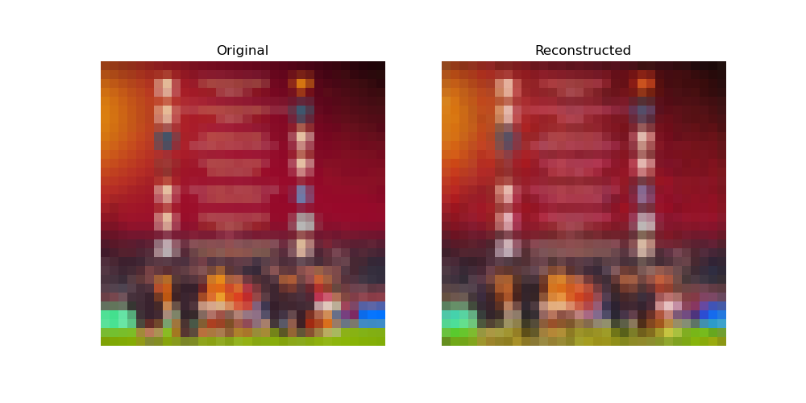

# Autoencoders Algorithm with Multiple Implementations and Applications


## Setup

```bash
$ conda create -n autoencoder python=3.10
$ source activate autoencoder
(autoencoder) $ conda install pytorch torchvision -c pytorch
```

Once you create the virtual environment and install the required packages, test the setup with the available options for the accelerated computing hardware.

```bash
(autoencoder) $ python hardware_check_for_pytorch.py
```

Expected output:

```bash
MPS is available.
tensor([[0.7936, 0.7428, 0.7157],
        [0.0030, 0.6629, 0.5413],
        [0.0956, 0.3334, 0.2965],
        [0.0265, 0.9308, 0.4023],
        [0.1697, 0.0599, 0.5917]], device='mps:0')
```

## Training

To start the training process, run the following command:

```bash
(autoencoder) $ python train_autoencoder.py
```

The training process will create an experiment directory with the following structure:

```bash
experiments/
└── experiment_YYYYMMDD_HHMMSS/
    ├── checkpoints/
    │   └── checkpoint_epoch_*.pth
    ├── plots/
    │   └── training_history.png
    ├── logs/
    │   ├── training_log.txt
    │   └── training_history.pth
    ├── models/
    │   └── final_model.pth
    └── config.json
```

I encounter an issue with installing files with conda then I found the solution with;

```bash
(autoencoder) $ conda install libpng jpeg
```

Reference for the solution: https://discuss.pytorch.org/t/failed-to-load-image-python-extension-could-not-find-module/140278/32 


## Inference

To run the inference process, use the following command:

```bash
(autoencoder) $ python inference.py
```

expected output after running:

Model selection from the available ones. Enter the index of the model you want to use for inference: 

```bash
Available experiments:
--------------------------------------------------------------------------------
Index  Date             Final Loss   Device   Epochs
--------------------------------------------------------------------------------
0      20230910_170000  0.000000    mps      10
1      20230910_170000  0.000000    mps      10

Select experiment index: 0

```

Then, enter the image path you want to compress:

```bash
Enter path to image file (or 'q' to quit): /path/to/image.jpg

Results saved to: /path/to/experiment_YYYYMMDD_HHMMSS/inference_results/comparison_YYYYMMDD_HHMMSS.png
Compression ratio: 1.23x

```

After inference complete, the compressed image will be saved in the experiment directory.




The result is fantastic, right?


## ToDo List

 - [ ] Adjust learning rate based on the training trend.
 - [ ] Accelerate the data loading process.
 - [ ] Adjust the batch size based on the available memory.
 - [ ] Make the model small enough to run on Raspberry Pi or other low-end devices.
 - [ ] Run the repository on multiple devices including GPU, MPS, and CPU and report the training, validation, and inference times.
 - [ ] Add more architectures to the repository for the same purpose which is image compression.
 - [ ] Build a web application for the inference process.
 - [ ] Build a mobile application for the inference process.
    + [ ] iOS with ONNX model.


## Contributing

If you find any issues or have suggestions for improvements, please feel free to open an issue or submit a pull request. Your contributions are highly appreciated!

Happy autoencoding!
